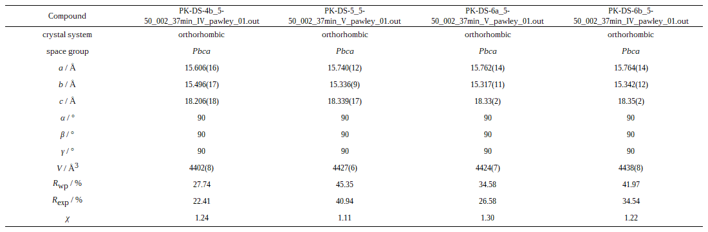

# cell_param_tables

Turn a folder of TOPAS Pawley/Rietveld `.out` files into a single, publication-ready HTML table of refined cell parameters — in about ten seconds.



Each column corresponds to one input `.out` file. Values are crystallographically rounded (`15.606(16)` means *a* = 15.606 Å with standard deviation 0.016), space-group symbols are italicized correctly, and the file is ready to paste into a thesis, paper, or supporting information.

---

## Quick start

```bash
pip install beautifulsoup4
python cell_param_tables.py
```

Run it from any directory. The script walks the tree, lists every `.out` file it finds, asks you which ones to include, and writes a single HTML table.

That's it. Open the resulting `.htm` in a browser or paste it straight into Word — the formatting carries over.

---

## What you'll see

```
Found 4 .out file(s) under C:\...\examples:

  [1] PK-DS-4b_5-50_002_37min_IV_pawley_01.out
  [2] PK-DS-5_5-50_002_37min_V_pawley_01.out
  [3] PK-DS-6a_5-50_002_37min_V_pawley_01.out
  [4] PK-DS-6b_5-50_002_37min_IV_pawley_01.out

Select files by:
  - "all"
  - indices, e.g. "1,3,5" or "1 3 5"
  - ranges, e.g. "2-4"
  - wildcards (fnmatch), e.g. "*IV*" or "PK-DS-6?_*"
  - any mix of the above, comma/space separated

Selection: *IV*

Selected 2 file(s):
  - PK-DS-4b_5-50_002_37min_IV_pawley_01.out
  - PK-DS-6b_5-50_002_37min_IV_pawley_01.out
Proceed? [Y/n]:

Output filename [done.htm]: IV_subset
PK-DS-4b_5-50_002_37min_IV_pawley_01.out: (1/2)
PK-DS-6b_5-50_002_37min_IV_pawley_01.out: (2/2)

Wrote IV_subset.htm
```

---

## Selection syntax

The wizard's selection prompt accepts any combination of:

| Form | Example | Meaning |
| --- | --- | --- |
| `all` | `all` | Every file in the list |
| Index | `3` | The 3rd file |
| Index list | `1,3,5` or `1 3 5` | Selected files |
| Range | `2-4` | Files 2, 3, and 4 |
| Wildcard | `*IV*` | Every file whose name matches (Unix-style `fnmatch`) |
| Mix | `1 *V* 5-7` | All of the above, comma- or space-separated |

If the target output file already exists, the wizard warns and lets you choose a new name — so a "just-the-IV-samples" run doesn't clobber a previous "all-samples" run.

---

## What it actually extracts

For each `.out` file the script pulls:

- **Space group** (numeric or symbolic — both forms work) and crystal system
- **Lattice constants** `a`, `b`, `c`, `α`, `β`, `γ` (and infers the rest from the crystal system when only the unique values are written)
- **Cell volume**
- **Fit statistics** `R_wp`, `R_exp`, `χ²`

Values with TOPAS-format errors like `` 15.606`_0.016 `` are turned into `15.606(16)` via crystallographic rounding. Quantities that can't be parsed are reported as `Not found` rather than silently dropped.

Both standard notations are supported:

```
a 15.606`_0.016
b 15.496`_0.017
c 18.206`_0.018
```

and the compact alt notation:

```
Orthorhombic(@ 15.479`_0.001, @ 15.485`_0.001, @ 18.097`_0.001)
```

---

## Installation

Requirements: **Python 3.6+** and **beautifulsoup4**.

```bash
pip install beautifulsoup4
```

No other dependencies. The space-group lookup table and HTML template are embedded directly in `cell_param_tables.py` (gzip+base64 — about 25 KB), so the only file you need to ship is the script itself.

---

## Project layout

```
cell-param-tables/
├── cell_param_tables.py     # The script — run this
├── dump_resource.py         # Maintainer tool: rebuild embedded data from resource.htm
├── resource.htm             # Source of truth for the embedded lookup table
├── examples/
│   ├── *.out                # Four sample TOPAS output files
│   ├── example_output.htm   # Generated table
│   └── example_output.png   # Screenshot used in this README
├── .gitignore
└── README.md
```

---

## How it works

<details>
<summary>Click to expand — the implementation details most users won't need.</summary>

### Parsing strategy

`.out` files are matched against a small ordered list of regexes per quantity. The first pattern that matches wins. When a quantity is "missing" because the crystal system makes it implicit (e.g. `b` and `c` aren't written for cubic), the script consults a crystal-system → equality table and fills them in. When neither standard nor implicit values appear, it falls back to the compact `Orthorhombic(...)` / `Hexagonal(...)` / etc. notation via a second regex set.

### Crystallographic rounding

Means and errors are pushed through `decimal.Decimal` (precision 32) to avoid floating-point drift. The error's leading significant digit determines how many decimal places of the mean are kept. If the rounded error's leading digits exceed 20, an extra rounding step is applied to drop to a single bracketed digit. The end result matches the conventions used in crystallographic papers — `15.606(16)`, not `15.6060 ± 0.0163`.

### Embedded resources

`cell_param_tables.py` carries two gzip+base64 blobs:

- `_SG_B64` — the space-group → (formatted-HTML, crystal-system) lookup dict, ~1019 entries, encoded as JSON.
- `_TPL_B64` — the column template HTML (the resource minus the lookup table), ready to clone for each input file.

Both decode in well under a millisecond at startup. The advantage is that the script is self-contained — no need to keep `resource.htm` next to it.

To regenerate the blobs (e.g. after editing the space-group list in `resource.htm`):

```bash
python dump_resource.py
```

This rewrites the embedded block between the `# === EMBEDDED RESOURCE DATA …` markers in `cell_param_tables.py` in place.

</details>

---

## Authorship and history

This project was originally written by **[@p3rAsperaAdAstra](https://github.com/p3rAsperaAdAstra)** as `TOPAS_Parameter_Tables_NEW.py`. The original script and its companion `resource.htm` (a Word-exported HTML table mapping every space group to its formatted symbol and crystal system) are entirely the original author's work.

In May 2026 the script was **refactored and partially rewritten by Claude (Anthropic's AI assistant)** at the author's direction. The user-visible changes:

- **Interactive selection wizard** with `all` / indices / ranges / wildcards instead of a blind `glob('*.out')`.
- **Recursive file discovery** (the original only looked in the current directory).
- **Custom output filenames** with an overwrite guard.
- **Embedded resources** — `resource.htm` is no longer required at runtime; the parsed lookup table and template are baked into the script as compact gzip+base64 blobs.
- **Added Orthorhombic support** to the alt-notation parser (previously skipped).
- **Migrated `findAll` → `find_all`** to silence BeautifulSoup 4.x deprecation warnings.
- **Cleaner output naming** — input filenames in the table now use the basename rather than a relative path (so recursive discovery doesn't leak directory names into the rendered table).

The core parsing logic — regex sets, crystallographic rounding, crystal-system inference, the Word-derived `resource.htm` — is unchanged from the original. This note is included for transparency about what is and isn't human-authored.

The pre-rewrite version is preserved in the git history under tag `v1.2` / commit `15fac92`.
